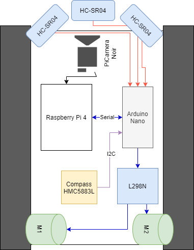
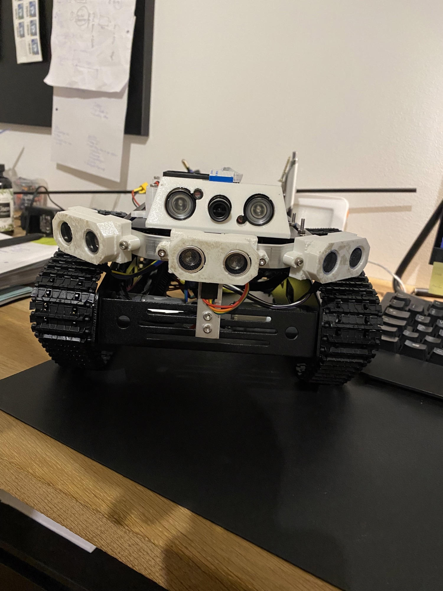
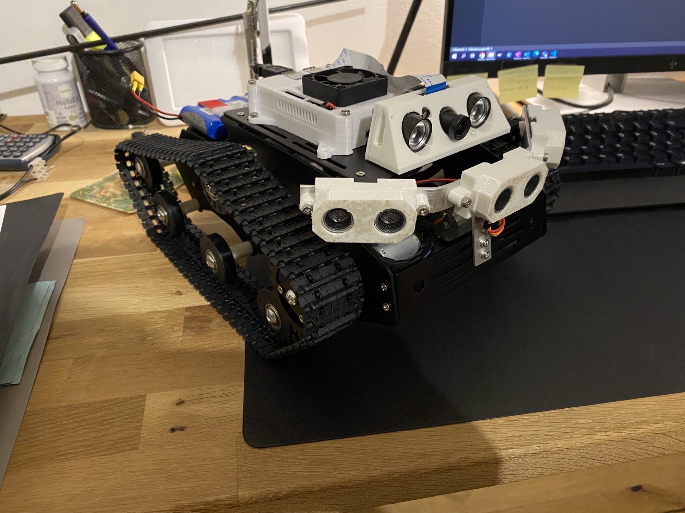
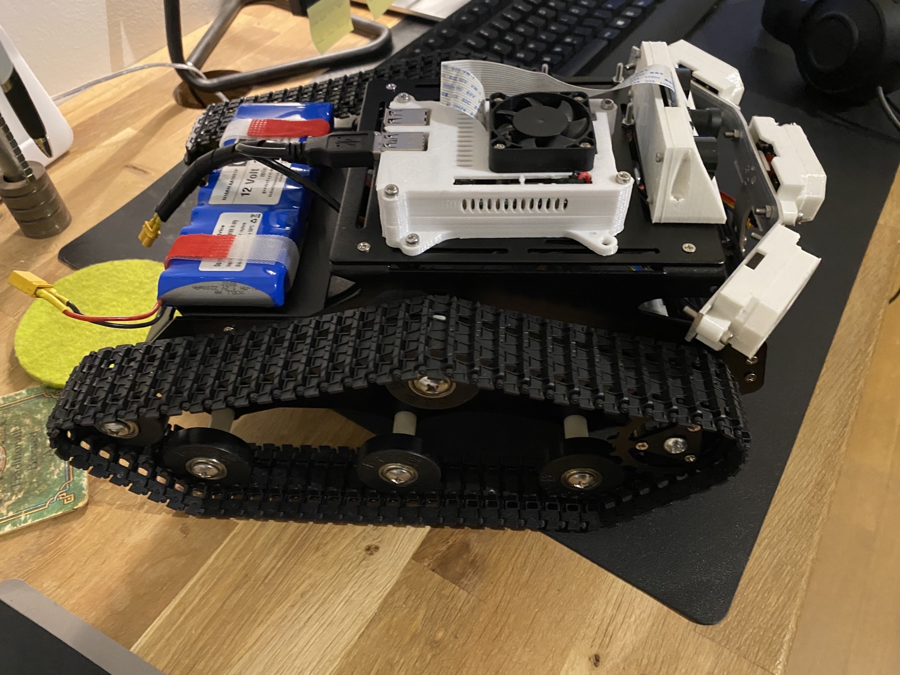

# Rover with ROS2

Test platform for robotics

https://tlk-energy.de/blog/pid-regler-einstellen
https://github.com/joshnewans/ros_arduino_bridge/tree/main
https://www.youtube.com/watch?v=-PCuDnpgiew
https://www.youtube.com/watch?v=bsB5shP3vls Synchronizing Motor Position with Encoders, PID Control and Arduino

https://articulatedrobotics.xyz/mobile-robot-full-list/

# Arduino Encoder Motor Ros

https://github.com/joshnewans/ros_arduino_bridge/blob/main/ROSArduinoBridge/sensors.h
https://github.com/jumejume1/dc-motor-encoder
https://github.com/EwingKang/Simple-ROS-Arduino-odometry/blob/master/arduino_files/serial_odom/wheel.h
https://github.com/JeelChatrola/Control-of-motor-with-ROS
https://github.com/JeelChatrola/Control-of-motor-with-ROS/blob/master/Motor%2Bencoder_rosserial.ino
https://forum.arduino.cc/t/pid-controller-speed-control-for-a-dc-motor-with-encoder/985306/15
https://automaticaddison.com/how-to-publish-wheel-odometry-information-over-ros/
https://www.youtube.com/watch?v=SiIDwKyg7pQ ROS Odometry example using ROSSerial Arduin

## Electronics

Custom parts:

    https://github.com/yohendry/arduino_L298N
    https://fritzing.org/projects/hc-sr04-project
    https://forum.fritzing.org/t/dc-motor-with-two-phase-encoder/3776
    https://forum.fritzing.org/t/look-for-fritzing-part-12v-lithium/16352

## To buy

    2x Getriebemotor DC 12V Mit Encoder 130 RPM Metall Getriebe Motor GA25-370
    1x 3-Axis Digital Compass HMC5883L
    3x HC-SR04 Ultrasonic Sensor
    1x L298N Bridge

Author: cmb87